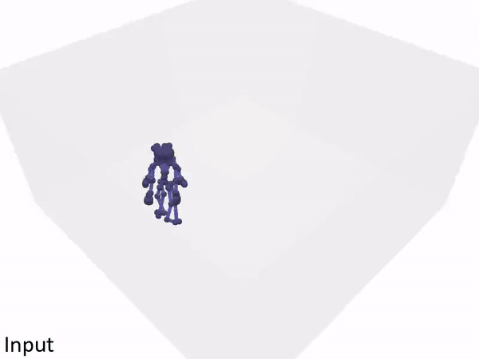
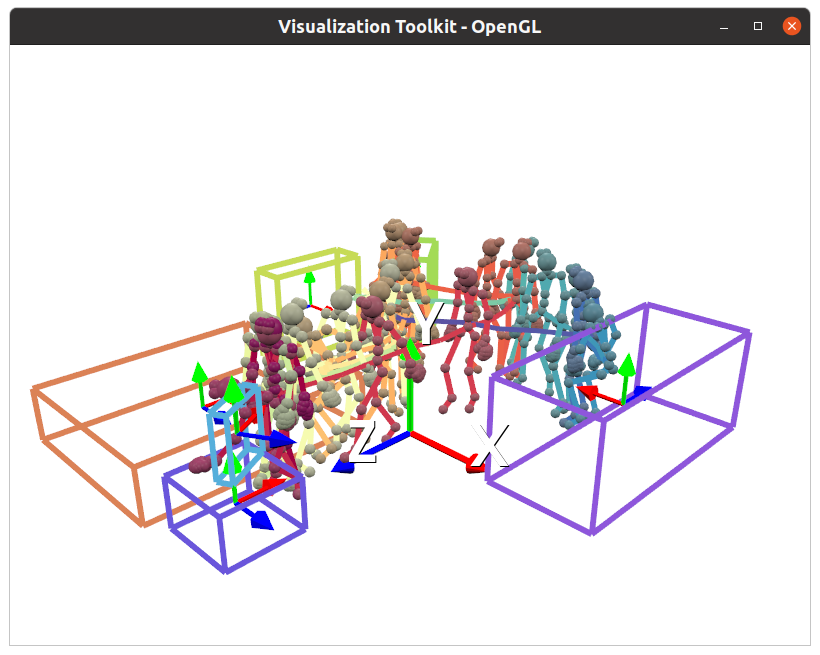
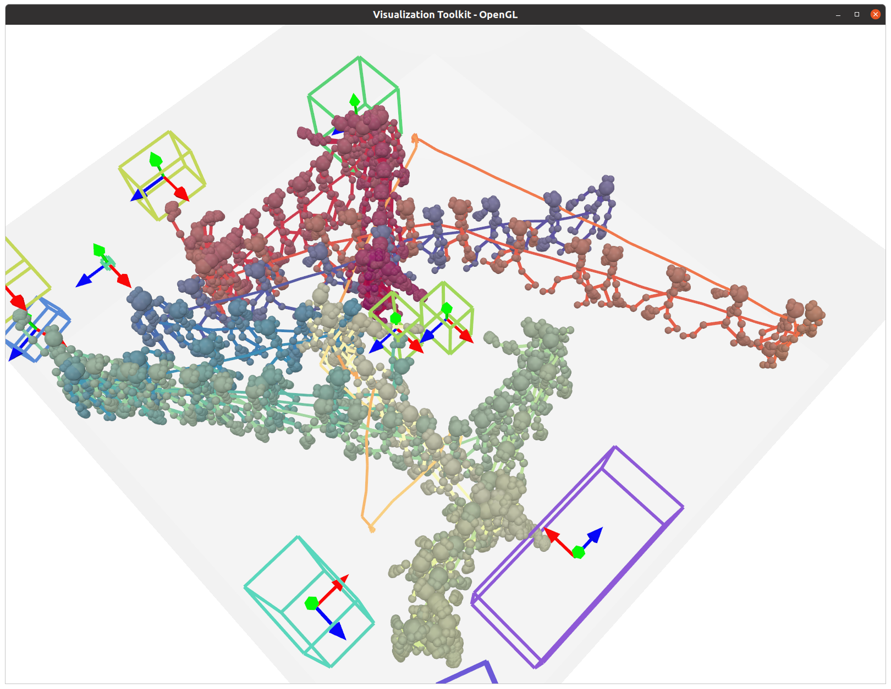

# Pose2Room [[Project]](https://yinyunie.github.io/pose2room-page/)[[Paper]](https://arxiv.org/abs/2112.03030)[[Video]](https://youtu.be/MFfKTcvbM5o)

**Pose2Room: Understanding 3D Scenes from Human Activities** <br>
Yinyu Nie, Angela Dai, Xiaoguang Han, Matthias Nießner <br>
In [ECCV, 2022](https://eccv2022.ecva.net/).

  

---

### Install
Our repository is developed under Ubuntu 20.04.

```
git clone https://github.com/yinyunie/Pose2Room.git
cd ./Pose2Room
```

1. We recommend to install with conda by
```
conda env create -f environment.yml
conda activate p2rnet
```

2. Install [PointNet++](https://github.com/erikwijmans/Pointnet2_PyTorch) utilities.
```commandline
export CUDA_HOME=/usr/local/cuda-X.X  # replace cuda-X.X with your cuda version.
cd external/pointnet2_ops_lib
pip install .
```

3. (Optional) If you would like to synthesize pose and scene data on your own, the [VirtualHome](https://github.com/xavierpuigf/virtualhome) platform is required. Please refer to [link](utils/virtualhome) for installation details. 

---

### Demo
The pretrained model can be downloaded [here](https://tumde-my.sharepoint.com/:f:/g/personal/yinyu_nie_tum_de/EgL3cuXA-ntHij817MTAkaABuQNcB2MEEkK_jjkJv2w39Q?e=xpGomP). Put `script_level.pth` under the folder of `out/p2rnet/train/pretrained_weight/`. A demo is illustrated below to see how our method works.
```commandline
python main.py --config configs/config_files/p2rnet_test.yaml --mode demo
```

[VTK](https://vtk.org/) is used to visualize the 3D scene.
If everything goes smooth, there will be a GUI window popped up and you can interact with the scene.



---
### Dataset
We synthesize our dataset using [VirtualHome](https://github.com/xavierpuigf/virtualhome) platform.
You can either download and extract the dataset from [link](https://tumde-my.sharepoint.com/:u:/g/personal/yinyu_nie_tum_de/ESeI-yefoelJvMEaj7LGm0UB9Jq1qYraq0BtsemMxBV-DQ?e=QKjNgy) to 
```angular2html
/home/ynie/Projects/pose2room/datasets/virtualhome/samples/*.hdf5
```

or synthesize the dataset with our scripts (please follow [link](utils/virtualhome)).

After obtained the dataset, you can visualize a GT sample following
```commandline
python utils/virtualhome/vis_gt_vh.py
```
and a GT sample will be visualized as below if everything is working well so far.


---

### Training and Testing

We use the configuration file (see 'configs/config_files/****.yaml') to fully control the training and testing process.
You can check and modify the configurations in specifc files for your need.

#### Training

Here is an example of training on sequence-level split:

For training on multiple GPUs, we use distributed data parallel and run
```commandline
python -m torch.distributed.launch --nproc_per_node=4 --use_env --master_port=$((RANDOM + 9000)) main.py --config configs/config_files/p2rnet_train.yaml --mode train
```

You can also train on a single GPU by
```commandline
python main.py --config configs/config_files/p2rnet_train.yaml --mode train
```

If you would like to train on room-level split, you can modify the data split to in `p2rnet_train.yaml` file
```angular2html
data:
  split: datasets/virtualhome_22_classes/splits/room_level
```
It will save the network weights to `./out/p2rnet/train/a_folder_with_time_stamp/model_best.pth`

You can monitor the training process using `tensorboard --logdir=runs`.
The training log is saved in `./out/p2rnet/train/a_folder_with_time_stamp/log.txt`. 

#### Testing
After training, you can copy the trained weight path to `configs/config_files/p2rnet_test.yaml` file as
```commandline
weight: ['out/p2rnet/train/a_folder_with_time_stamp/model_best.pth']
```
and evaluate it by
```commandline
python main.py --config configs/config_files/p2rnet_test.yaml --mode test
```
It will save the evaluation scores and the prediction results to `./out/p2rnet/train/a_folder_with_time_stamp/log.txt`
and `./out/p2rnet/train/a_folder_with_time_stamp/visualization` respectively.

You can visualize a prediction result by
```commandline
python ./utils/virtualhome/vis_results.py pred --pred-path out/p2rnet/test/a_folder_with_time_stamp/visualization
```
If everything goes smooth, it will output a visualization window as below.



(Optional) We also provide virtual scanned VirtualHome scenes in [link](https://tumde-my.sharepoint.com/:u:/g/personal/yinyu_nie_tum_de/EY3hH7qxqxFPjPHgaT7Dgc0BFvJz5HrTTKPoq_AcOAOCSQ?e=IsTJsu),
you can download & extract it to `datasets/virtualhome_22_classes/scenes/*`, and visualize it with poses and GT boxes by
```commandline
python ./utils/virtualhome/vis_results.py gt --pred-path out/p2rnet/test/a_folder_with_time_stamp/visualization --vis_scene_geo
```

---

### Citation
If you find our code and data helpful, please consider citing
```
@article{nie2021pose2room,
title={Pose2Room: Understanding 3D Scenes from Human Activities},
author={Yinyu Nie and Angela Dai and Xiaoguang Han and Matthias Nie{\ss}ner},
journal={arXiv preprint arXiv:2112.03030},
year={2021}
}
```

### Acknowledgments
We synthesize our data using VirtualHome platform. If you find our data
helpful, please also cite [VirtualHome](https://github.com/xavierpuigf/virtualhome) properly. 

### License
This repository is relased under the MIT License. See the [LICENSE file](LICENSE) for more details.
