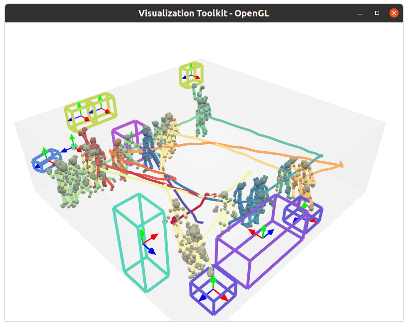

# Data Synthesis with VirtualHome 

---

## Install
We synthesize our dataset under Ubuntu 20.04 with X server.

1. Clone [VirtualHome](https://github.com/xavierpuigf/virtualhome) repository to local, and checkout the specific commit id used in our paper by
```angular2html
cd ./external
git clone https://github.com/xavierpuigf/virtualhome
cd ./virtualhome
git checkout c5c2d9633fbc0065ca0a3d3d868b66a9ee0b6956
cd ../..
```

2. Download the VirtualHome simulator (v2.2.3) to local
```angular2html
cd ./external/virtualhome/simulation/unity_simulator
wget http://virtual-home.org//release/simulator/v2.0/v2.2.3/linux_exec.zip
```

3. Extract all items in `linux_exec.zip` to the `./external/virtualhome/simulation/unity_simulator` folder, and make sure this folder looks like
```angular2html
./external/virtualhome/simulation/unity_simulator
|-- ...
|-- linux_exec.v2.2.3_Data
|-- linux_exec.v2.2.3.x86_64
|-- LinuxPlayer_s.debug
|-- UnityPlayer.so
|-- UnityPlayer_s.debug
|-- ...
```

4. (Optional) Install [TSDF-Fusion](https://github.com/andyzeng/tsdf-fusion-python) under `./external`, and rename it to `tsdf_fusion`, if you also want to capture the scene geometry in virtualhome.
```angular2html
cd ./external
git clone https://github.com/andyzeng/tsdf-fusion-python
mv tsdf-fusion-python tsdf_fusion
```

---

## Synthesize Data
[VirtualHome](https://github.com/xavierpuigf/virtualhome) provides a platform to synthesize humanoid agent interaction
motions with objects using action scripts. It allows customization of action scripts and control over humanoid agents
to execute a series of complex interactive tasks. We refer readers to [link](http://virtual-home.org/documentation/master/#)
for more details of how VirtualHome works.

We follow the routine below to synthesize our motion data:
1. Generate **agent action scripts** and output **object bounding boxes** for each room.
2. Use action scripts to synthesize **skeleton animations**.
3. Export data for training.

### 1. Action Scripts and Object Bounding Boxes

Before generating skeleton animations, we first need to generate agent action scripts for each room. A action script
is something like this:

The character `<char0>` walks to a `candle`, then grabs it and puts it onto a `bathroomcabinet`.
```html
[...
 "<char0> [Walk] <candle> (70)", 
 "<char0> [Find] <candle> (70)",
 "<char0> [Grab] <candle> (70)", 
 "<char0> [Find] <bathroomcabinet> (49)",
 "<char0> [Put] <candle> (70) <bathroomcabinet> (49)".
 ...]
 ```

There are 29 rooms in 7 scenes in VirtualHome v2.2.3 which is the version we used in our paper. 
(Update: Now VirtualHome v2.3.0 has added new environments, see [link](http://virtual-home.org/documentation/master/downloads/downloads.html))

For each room, we synthesize the action scripts by
```commandline
python ./utils/virtualhome/1_generate_programs.py  --scene-id 3 --room-id 0
```

In each room, we select up to 10 random objects, and script the agent to interact with each of the objects in a
sequential fashion. It will output all the action scripts and the object bounding boxes in this room. For each
interaction we also assign the respective object id to the action.

The above data will be saved in `datasets/virtualhome_22_classes/script_bbox/*`.

(*Note: you can also download this data generated by us from [link](https://tumde-my.sharepoint.com/:u:/g/personal/yinyu_nie_tum_de/EbQJdYJq_QJIpj63S0git2UBJDaooF8c0_29ZjMEsmvTQA?e=ikF3ta),
and extract it to the same folder)

### 2. Skeleton Animations
We use the generated action scripts to synthesize skeleton animations. There are several agent characters, where we use
`'Chars/Female2'` as the agent model in our paper.

Here we synthesize skeleton animations for 5 characters following the action scripts above:
```commandline
python ./utils/virtualhome/2_generate_skeletons.py
```
A Unity3D window will pop up during the on-screen animation. If you only want to synthesize for a specific agent
character, you can modify `configs/dataset_config.py` as below
```angular2html
self.character_names = ['Chars/Female2']
```

The skeleton animations will be saved in `datasets/virtualhome_22_classes/recording/*`

(*Note: you can also download this data generated by us from [link](https://tumde-my.sharepoint.com/:u:/g/personal/yinyu_nie_tum_de/EZjKkoxm741PsticYrFPQ2AB72KokWHdcY2vjsws1QwmmQ?e=sgLHbM),
and extract it to the same folder)

### 3. Process for training
We wrap all the synthesized data for training by
```commandline
python ./utils/virtualhome/3_generate_samples.py --no-augment
```
(*Note: data augmentation has already been written in dataloader.)

The data for training will be saved in `datasets/virtualhome_22_classes/samples/*`

(*Note: you can also download this data from [link](https://tumde-my.sharepoint.com/:u:/g/personal/yinyu_nie_tum_de/ESeI-yefoelJvMEaj7LGm0UB9Jq1qYraq0BtsemMxBV-DQ?e=OBvi1r),
and extract it to the same folder)


#### To Verify
You can verify the synthesized results by
```commandline
python utils/virtualhome/vis_gt_vh.py
```
and a GT sample will be visualized as below if everything is working well so far.




### 4. Synthesize Scene Mesh (Optional)
If you want to obtain the room meshs in VirtualHome, we also provide our virtual scanning code
```commandline
python ./utils/virtualhome/vis_vhome.py 
```

This will pop up a visualization window containing room mesh, object boxes and poses.

---
### Acknowledgments
We synthesize our code using [VirtualHome](http://virtual-home.org/documentation/master/index.html) platform. If you find our code
helpful, please consider citing both of our works.


